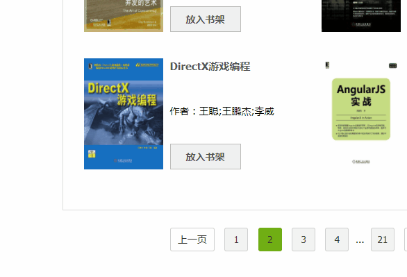

# Popup Series

In front-end page development, we often encounter components such as tooltips, drop-down menus, selection boxes, date selection, etc. They all have one thing in common, which is the pop-up layer function.

We can quickly implement a simple floating prompt using the following CSS.

```css
.popper { display: none; }
.root:hover .popper { display: block; }
```

But when encountering the situation where the `click` event needs to be triggered, or the elements are not necessarily parent-child elements, it becomes a bit stretched.

Sometimes students will encapsulate a simple `v-click-outside` instruction to temporarily solve the problem of closing the pop-up layer, but this requires some additional code to complete. The same logic of different components is bound to include some redundant work.

And because of the uncertainty of the position of the component on the page, a simple pop-up layer cannot handle edge cases. For example, for a container with overflow: visible , it may cause page jitter; and for a container with other overflow values, scrolling is required to fully display it.



At this time, a basic component is urgently needed to "fill" the "pits" of the above situations.

## Functional Design

### Popup Layer [Popper](/proto-ui/m-popper)

There is a popular open source library [Popper.js](https://popper.js.org/) on the market, which solves problems such as edge cases and position calculations.

The [Popper component](/proto-ui/m-popper) in Proto UI is a Vue encapsulation of it.

#### Slots

We can find that the pop-up layer related components mentioned above all need to have a **trigger node (reference node)** and a **pop-up layer node**.

> The term "trigger node" is more appropriate here than "trigger element" because sometimes a node is a component.

`<m-popper>` is designed like this, and its basic usage is as follows:

``` html
<u-button>
    click
    <m-popper>
        <u-block>popper</u-block>
    </m-popper>
</u-button>
```

The default slot is used to represent the trigger node (reference node), and the popper slot is used to represent the popup layer node. Due to the limitations of Vue, there can only be one root node in each slot.

#### Trigger Method

There are five triggering methods designed in Proto UI: `'click'`, `'hover'`, `'right-click'`, `'double-click'`, `'manual'`.

#### Switch Properties

All popup layers use the `open` property to indicate the popup state, support two-way binding using the `.sync` method, and do not support `v-model` (because it is not a form feature).

#### Popup Location

Same as Popper.js, there are 12 pop-up positions: `'top'`, `'bottom'`, `'left'`, `'right'`, `'top-start'`, `'top-end'`, `'bottom-start'`, `'bottom-end'`, `'left-start`',` 'left-end'`, `'right-start'`, `'right-end'`.

### Popup box [Popup](/proto-ui/u-popup)

`<m-popper>` has no template or style itself. It is an abstract component that solves the pop-up layer problem. `<u-popup>` is concretized on its basis, with a triangular arrow and can fill some content in different slots.

``` html
<u-linear-layout>
    <u-button>
        Content
        <u-popup>Use the content attribute to add content</u-popup>
    </u-button>
    <u-button>
        Title
        <u-popup title="Title">Use the title attribute to add a title</u-popup>
    </u-button>
    <u-button>
        Using Slots
        <u-popup>
            <span slot="title">Title<u-badge :value="3"></u-badge></span>
            <span>Use <u-link>slot</u-link> to add some complex functions</span>
        </u-popup>
    </u-button>
</u-linear-layout>
```

#### Customization

Using root slot, you can easily customize the content. Combining it with the `<u-menu>` component will result in a Dropdown menu, combining it with the `<u-calendar>` component will result in a DatePicker, combining it with the `<u-pallette>` component (palette) will result in a ColorPicker, and combining it with the `<u-tree-view>` component will result in a tree selection.

``` html
<u-linear-layout>
    <u-button>
        Dropdown
        <u-popup>
            <u-menu slot="root" value="3" :router="false">
                <u-menu-item value="1">Guide</u-menu-item>
                <u-menu-item value="2">Concept</u-menu-item>
                <u-menu-item value="3">Component</u-menu-item>
            </u-menu>
        </u-popup>
    </u-button>
    <u-button>
        TreeView
        <u-popup>
            <u-tree-view slot="root">
                <u-tree-view-node text="Node 1">
                    <u-tree-view-node text="Node 1.1"></u-tree-view-node>
                    <u-tree-view-node text="Node 1.2">
                        <u-tree-view-node text="Node 1.2.1"></u-tree-view-node>
                        <u-tree-view-node text="Node 1.2.2"></u-tree-view-node>
                    </u-tree-view-node>
                    <u-tree-view-node text="Node 1.3"></u-tree-view-node>
                    <u-tree-view-node text="Node 1.4"></u-tree-view-node>
                </u-tree-view-node>
                <u-tree-view-node text="Node 2"></u-tree-view-node>
                <u-tree-view-node text="Node 3">
                    <u-tree-view-node text="Node 3.1"></u-tree-view-node>
                    <u-tree-view-node text="Node 3.2"></u-tree-view-node>
                </u-tree-view-node>
            </u-tree-view>
        </u-popup>
    </u-button>
</u-linear-layout>
```

The only logic that may need to be supplemented is to automatically close the popup layer after selection, which can be handled in the encapsulated component.

``` vue
<template>
    <u-button>
        TreeView
        <u-popup ref="popup">
            <u-tree-view slot="root" @select="onSelect">
                <u-tree-view-node text="Node 1">
                    <u-tree-view-node text="Node 1.1"></u-tree-view-node>
                    <u-tree-view-node text="Node 1.2">
                        <u-tree-view-node text="Node 1.2.1"></u-tree-view-node>
                        <u-tree-view-node text="Node 1.2.2"></u-tree-view-node>
                    </u-tree-view-node>
                    <u-tree-view-node text="Node 1.3"></u-tree-view-node>
                    <u-tree-view-node text="Node 1.4"></u-tree-view-node>
                </u-tree-view-node>
                <u-tree-view-node text="Node 2"></u-tree-view-node>
                <u-tree-view-node text="Node 3">
                    <u-tree-view-node text="Node 3.1"></u-tree-view-node>
                    <u-tree-view-node text="Node 3.2"></u-tree-view-node>
                </u-tree-view-node>
            </u-tree-view>
        </u-popup>
    </u-button>
</template>

<script>
export default {
    name: 'u-tree-select',
    methods: {
        onSelect() {
            this.$refs.popup.toggle(false);
        },
    },
};
</script>
```

> The arrow style can be extended in specific business. If not needed, you can directly use `<m-popper>`.

## Related Components

### Tooltip (/proto-ui/u-tooltip)

Tooltips are similar to popups, except that they are different in style and the default trigger method is set to `hover`. The default slot is still used to set the trigger node.

There is a convenience command `v-tooltip` for tooltips.

### Menu[Menu](/proto-ui/u-menu)

There is no special Dropdown component in Proto UI, because its triggering node is uncertain, and it can be completely implemented by combining `<m-popper>` or `<u-popup>` with `<u-menu>`.

``` html
<u-linear-layout>
    <u-button>
        Popup Menu
        <u-popup>
            <u-menu slot="root">
                <u-menu-item to="/guides/">Guidelines</u-menu-item>
                <u-menu-item to="/api/">API</u-menu-item>
                <u-menu-item to="/proto-ui/">Prototype Components</u-menu-item>
                <u-menu-item href="https://github.com/vusion">GitHub</u-menu-item>
            </u-menu>
        </u-popup>
    </u-button>
    <u-button>
        Popper Menu
        <m-popper>
            <u-menu value="3" :router="false" style="width: 128px;">
                <u-menu-item to="/guides/">Guidelines</u-menu-item>
                <u-menu-item to="/api/">API</u-menu-item>
                <u-menu-item to="/proto-ui/">Prototype Components</u-menu-item>
                <u-menu-item href="https://github.com/vusion">GitHub</u-menu-item>
            </u-menu>
        </m-popper>
    </u-button>
</u-linear-layout>
```

And currently also supports multi-level menus:

``` html
<u-button>
    Multi-Level Menu
    <u-popup>
        <u-menu slot="root" style="width: 200px;">
            <u-menu-item>Guidelines</u-menu-item>
            <u-menu-item>API
                <u-menu slot="sub">
                    <u-menu-item to="/api/cli">Command Line Tool (CLI)</u-menu-item>
                    <u-menu-item to="/api/config">Configuration</u-menu-item>
                </u-menu>
            </u-menu-item>
            <u-menu-item> Component
                <u-menu slot="sub">
                    <u-menu-item> Prototype Component
                        <u-menu slot="sub">
                            <u-menu-item>Basic
                                <u-menu slot="sub">
                                    <u-menu-item to="/proto-ui/u-link">LinkLink</u-menu-item>
                                    <u-menu-item to="/proto-ui/u-button">ButtonButton</u-menu-item>
                                    <u-menu-item to="/proto-ui/u-badge">Badge</u-menu-item>
                                </u-menu>
                            </u-menu-item>
                            <u-menu-item>Navigation
                                <u-menu slot="sub">
                                    <u-menu-item to="/proto-ui/u-navbar">Navigation BarNavbar</u-menu-item>
                                    <u-menu-item to="/proto-ui/u-sidebar">Sidebar</u-menu-item>
                                    <u-menu-item to="/proto-ui/u-menu">MenuMenu</u-menu-item>
                                </u-menu>
                            </u-menu-item>
                            <u-menu-item>Popper
                                <u-menu slot="sub">
                                    <u-menu-item to="/proto-ui/m-popper">Pop-up Layer Popper</u-menu-item>
                                    <u-menu-item to="/proto-ui/u-tooltip">TooltipTooltip</u-menu-item>
                                    <u-menu-item to="/proto-ui/u-popup">Popup BoxPopup</u-menu-item>
                                </u-menu>
                            </u-menu-item>
                        </u-menu>
                    </u-menu-item>
                    <u-menu-item to="/ui-design">Component Design Plan</u-menu-item>
                </u-menu>
            </u-menu-item>
            <u-menu-item target="_blank" href="https://github.com/saashqdev/kubevue">GitHub</u-menu-item>
        </u-menu>
    </u-popup>
</u-button>
```

### Other Components

The following are components encapsulated based on `<m-popper>` or `<u-popup>`. `<u-date-picker>` and `<u-color-picker>` are on the way.

``` html
<u-linear-layout>
    <u-select>
        <u-select-item>Apple</u-select-item>
        <u-select-item>Banana</u-select-item>
        <u-select-item>Cake</u-select-item>
    </u-select>
</u-linear-layout>
```